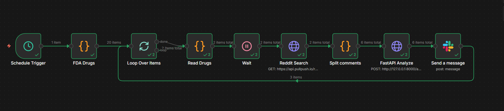

# Sentinel-PV: Autonomous Pharmacovigilance Agent

## Table of Contents

* [1. Project Overview](#1-project-overview)
* [2. Tech Stack](#2-tech-stack)
* [3. Part A: The Data Science Core (Model Training)](#3-part-a-the-data-science-core-model-training)
   * [BioBERT Fine-Tuning Strategy](#biobert-fine-tuning-strategy)
   * [Hybrid Dataset Approach (CADEC + Scraped Reddit Data)](#hybrid-dataset-approach-cadec--scraped-reddit-data)
   * [Model Evaluation Metrics](#model-evaluation-metrics)
* [4. Part B: The Intelligent Production System](#4-part-b-the-intelligent-production-system)
   * [B1: The Agentic Brain (Simulation & Core)](#b1-the-agentic-brain-simulation--core)
      * [Multi-Agent Architecture (LangGraph)](#multi-agent-architecture-langgraph)
      * [The Agent Workflow: Detector → Mapper → Investigator → Analyst](#the-agent-workflow-detector--mapper--investigator--analyst)
      * [FDA Data Verification via Model Context Protocol (MCP)](#fda-data-verification-via-model-context-protocol-mcp)
      * [Interactive Dashboard (Streamlit)](#interactive-dashboard-streamlit)
   * [B2: The Data Pipeline (Automation)](#b2-the-data-pipeline-automation)
      * [n8n Workflow Integration](#n8n-workflow-integration)
* [5. Code structure](#5-code-structure)
   * [3_agent_core (The Backend & Intelligence)](#3_agent_core-the-backend--intelligence)
   * [4_frontend (The User Interface)](#4_frontend-the-user-interface)
* [6. Quality Assurance & Evaluation (Ragas)](#6-quality-assurance--evaluation-ragas)
* [7. Infrastructure & Deployment (Terraform)](#7-infrastructure--deployment-terraform)
* [8. Installation & Setup](#8-installation--setup)
   * [Prerequisites](#prerequisites)
   * [Backend Setup](#backend-setup)
   * [Frontend Setup](#frontend-setup)
* [9. Usage Guide](#9-usage-guide)

---

## 1. Project Overview

Sentinel PV is an end-to-end pharmacovigilance project I built to capture Adverse Drug Events (ADEs) hidden in informal patient conversations on social media. While learning about drug safety systems, I noticed that most traditional pipelines struggle with patient-generated text—people describe side effects using slang, typos, and casual language that keyword-based methods simply miss. This project is my attempt to close that gap by turning messy, real-world narratives into structured, medically meaningful safety signals that can be validated against official clinical data.

The data science core of Sentinel PV (Part A) is centered around a BioBERT-based Named Entity Recognition (NER) model that I fine-tuned using a hybrid dataset. I trained the model on the CADEC gold-standard corpus to ground it in proper medical reasoning, and then adapted it further using ~8,000 scraped Reddit comments so it could learn how patients actually talk online. This combination helps the model handle both formal clinical language and highly informal descriptions. I focused on 20 high-profile, high-patient-volume drugs—including GLP-1 agonists like Ozempic and Wegovy, and biologics such as Humira—because these drugs are frequently discussed online and generate a high volume of side-effect reports.

In production (Part B), I designed Sentinel PV as a multi-agent system orchestrated with LangGraph, where each agent has a clear responsibility. A Detector Agent (BioBERT) extracts drugs and symptoms from raw Reddit posts, a Mapper Agent (Llama 3.2) normalizes slang and misspellings into standardized medical terms (e.g., mapping informal phrases to MedDRA concepts), and an Investigator Agent queries official FDA labeling data through the Model Context Protocol (MCP). Finally, an Analyst Agent pulls everything together into a concise, clinical-style safety report. The entire pipeline is automated using n8n, allowing the system to continuously ingest real Reddit data and convert unstructured social chatter into structured, verifiable pharmacovigilance insights.


## 2. Tech Stack

* **LLMs:** Llama 3.2 (1B & 3B) via **Ollama**.
* **NER Model:** Custom Fine-tuned **BioBERT** (`dmis-lab/biobert-v1.1`).
* **Orchestration:** **LangGraph** (Stateful Multi-Agent Workflows).
* **Protocol:** **MCP (Model Context Protocol)** by Anthropic (Client/Server Architecture).
* **Vector DB:** **ChromaDB** with `sentence-transformers/all-MiniLM-L6-v2`.
* **Backend:** **FastAPI** (Asynchronous).
* **Frontend:** **Streamlit**.
* **Automation:** **n8n** (Workflow Automation).
* **Quality Control:** **Ragas** (RAG Assessment Framework).


## 3. Part A: The Data Science Core (Model Training)

*Location:* `1_data_science/notebooks/sentinel_pv_v3.ipynb`

### **BioBERT Fine-Tuning Strategy**
I fine-tuned the `dmis-lab/biobert-v1.1` model specifically for Token Classification to detect `DRUG` and `ADVERSE_EVENT` entities. This specialized training enables the system to parse unstructured social media text and identify symptoms even when hidden amidst slang or informal grammar.

### **Hybrid Dataset Approach (CADEC + Scraped Reddit Data)**
To ensure the model understands both clinical and casual language, I utilized a dual-source corpus:

* **CADEC:** A gold-standard dataset for establishing medical precision.
* **Scraped Reddit Data:** A custom dataset of ~8,000 comments from drug-specific subreddits (e.g., r/Ozempic) to expose the model to real-world typos and slang.
    * *Tooling:* The scraper used to build this dataset is located at `3_agent_core/ingest_reddit_history.py`.
    * *Usage:* Run `python ingest_reddit_history.py` to fetch fresh data. This generates a `raw_reddit_data.jsonl` file.
    * *Sample:* A structure example is available in `demo-files-generated/raw_reddit_data-DEMO.jsonl`.

### **Model Evaluation Metrics**
The model was evaluated using standard **Precision**, **Recall**, and **F1-Score** metrics. The training process prioritized maximizing the **Recall** for `ADVERSE_EVENT` tags to ensure the system catches every potential safety signal, minimizing the risk of false negatives in a safety-critical context.


## 4. Part B: The Intelligent Production System

*Location:* `/3_agent_core` & `/4_frontend`

This section transforms the research models into a live, autonomous application capable of processing real-world data in real-time. It separates the cognitive "Brain" from the automated "Feeder" to ensure scalability and modularity.

## B1: The Agentic Brain (Simulation & Core)

At the core of the production system lies a stateful **LangGraph** workflow that mimics the cognitive process of a human safety analyst. Rather than relying on a single large model, the system orchestrates a team of specialized agents supported by a vector-based knowledge engine:

* **Detector Agent (Perception):** The first line of defense uses the fine-tuned BioBERT model to scan raw text and extract specific entities (`DRUG` and `ADVERSE_EVENT`), identifying symptoms even when they are buried in informal narrative structures.
* **Mapper Agent (Normalization):** Acting as a semantic translator, this agent converts detected slang (e.g., "head feeling wobbly") into standardized MedDRA medical terminology. It employs a self-correcting JSON extraction technique to ensure data integrity during the handoff.
* **The Semantic Knowledge Engine (ChromaDB + MCP):**
To prevent hallucinations, the system relies on a local **Retrieval-Augmented Generation (RAG)** architecture. We indexed official FDA drug labels into a **ChromaDB** vector database, converting clinical text into mathematical embeddings. This is accessed via the **Model Context Protocol (MCP)**.
  * **How they work together:** The **Investigator Agent** (acting as an MCP Client) sends a query to the MCP Server. The server then runs a semantic vector search within ChromaDB to find contextually relevant evidence (e.g., matching "room spinning" to "Vertigo"). This decouples the reasoning layer from the knowledge layer, ensuring the agent always cites real, retrieval-based evidence.
* **Analyst Agent (Reasoning):** The final decision-maker employs a **Chain of Thought (CoT)** reasoning process. It synthesizes the patient's narrative, the mapped clinical terms, and the retrieved FDA evidence to construct a professional Clinical Safety Report, explicitly outlining the logic behind its risk assessment.

### **B2: The Data Pipeline (Automation)**

To ensure the system operates on fresh data rather than static datasets, an automated pipeline ingests patient narratives from the wild.

#### **n8n Workflow Integration:**
The system is fed by an automated low-code workflow that handles the extraction and pre-processing of social media data. The complete workflow configuration is provided in `my-n8n-workflow.json`, which can be imported directly into n8n. This workflow creates a continuous feedback loop, scraping new comments every hour, filtering for safety signals, and pushing them to the analysis API.



This workflow acts as the automated feeder for the Sentinel PV system. Instead of waiting for manual input, it proactively monitors social media for safety signals.

- Trigger: The process initiates automatically via a Schedule Trigger (currently set to run daily at 02:00).
- Data Source: It utilizes a Code Node to load a target list of FDA-monitored drugs (e.g., Ozempic, Mounjaro).
- Acquisition Loop: The workflow iterates through this drug list, using the Reddit Search Node to fetch the most recent comments and posts discussing these medications.
- Analysis: Raw text is extracted and sent via an HTTP Request to the local Sentinel PV API (POST http://localhost:8000/analyze), where the AI agents process the data.
- Alerting: Finally, the generated Clinical Safety Report is formatted and pushed directly to a Slack Channel for immediate review by the safety team.


## 5. Code Structure

### 3_agent_core (The Backend & Intelligence)

This directory contains the entire logic of the multi-agent system, the database connectors, and the API layer.

* **`main.py`**: The central nervous system of the project. It uses **LangGraph** to define the `StateGraph` workflow, explicitly mapping the edges between the four agent nodes (`detector`, `mapper`, `investigator`, `analyst`). It holds the `AgentState` schema definitions and acts as the entry point for the compiled runnable graph.
* **`api_service.py`**: The production gateway. Implemented using **FastAPI**, this script exposes the `POST /analyze` endpoint. It handles asynchronous request processing, allowing external tools (like the n8n workflow or the frontend) to submit text payloads to the LangGraph workflow without blocking the server.
* **`fda_mcp_server.py`**: The implementation of the **Model Context Protocol (MCP)**. This script runs a standalone MCP server that wraps the local ChromaDB instance as a callable tool named `search_fda_labels`. It manages the standard input/output streams that allow the Investigator Agent to "talk" to the database securely.
* **`ingest_knowledge.py`**: The "Knowledge Builder" script. It is responsible for initializing the system's long-term memory. It reads raw FDA drug label text, splits it into semantically meaningful chunks, generates vector embeddings using `all-MiniLM-L6-v2`, and persists them into the local **ChromaDB** vector store.
* **`ingest_reddit_history.py`**: The data acquisition utility. This script connects to the Reddit API (or scrapes via public endpoints) to fetch historical comment threads from targeted subreddits (e.g., r/Ozempic). It performs initial cleaning and formatting, outputting the `raw_reddit_data.jsonl` file used for testing and training.
* **`evaluate_quality.py`**: The automated grader. This script parses the system's interaction logs (`ragas_logs.jsonl`) and uses the **Ragas** framework to compute `Faithfulness` and `Answer Relevancy` scores. It generates a CSV report card to objectively measure if the Analyst Agent is hallucinating or staying true to the FDA data.

### 4_frontend (The User Interface)

This directory contains the **Streamlit** applications that provide a human-readable window into the AI's operations.

* **`dashboard.py`**: The primary simulation interface. It renders the main UI where users can input raw patient narratives. It connects to the `api_service` backend, visualizes the step-by-step reasoning process of each agent (showing the raw detected entities and mapped terms), and displays the final Markdown-formatted Clinical Safety Report.
* **`admin.py`**: The system diagnostics panel. This interface provides an "under-the-hood" view for administrators. It includes functionality to inspect the contents of the ChromaDB vector store, view raw system logs, and monitor the volume of data ingested by the n8n pipelines.

## 6. Quality Assurance & Evaluation (Ragas)

*Location:* `3_agent_core/evaluate_quality.py`

In a high-stakes domain like pharmacovigilance, "trust but verify" is the golden rule. We cannot rely solely on an LLM's confidence. To address this, we implemented an automated evaluation pipeline using the **Ragas** framework.

* **The Process:** The system logs every agent interaction (inputs, retrieved contexts, and final outputs). The evaluation script parses these logs and uses a separate "Judge LLM" to grade the performance.
* **Key Metrics:**
* **Faithfulness:** Measures if the Analyst's report is factually grounded in the retrieved FDA evidence (preventing hallucinations).
* **Answer Relevancy:** Measures how pertinent the generated safety report is to the specific patient narrative provided.


* **Output:** The script generates a detailed CSV report card. A sample evaluation can be found in `demo-files-generated/evaluation_report-DEMO.csv`.

## 7. Infrastructure & Deployment (Terraform)

*Location:* `2_infrastructure/terraform/`

To ensure the system is reproducible and scalable, the underlying cloud infrastructure is managed using **Terraform** (Infrastructure as Code). This module automates the provisioning of the necessary Google Cloud Platform (GCP) resources required to host the API and Streamlit dashboard.

**Configuration (Required)**

To keep sensitive details private, this project uses a `terraform.tfvars` file which is excluded from version control. You must create this file manually before deploying:

1. Navigate to the directory: `2_infrastructure/terraform/`
2. Create a file named `terraform.tfvars`.
3. Add your specific Google Cloud Project ID inside:
```hcl
project_id = "your-gcp-project-id-here"

```
